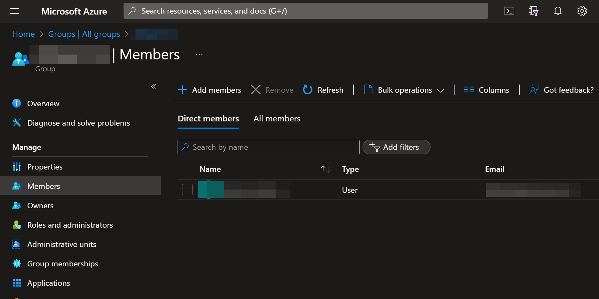
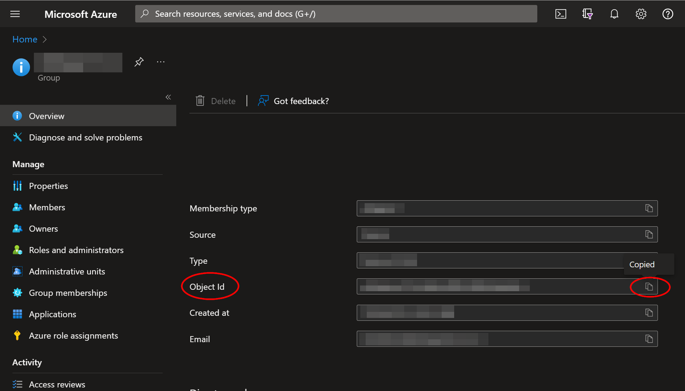
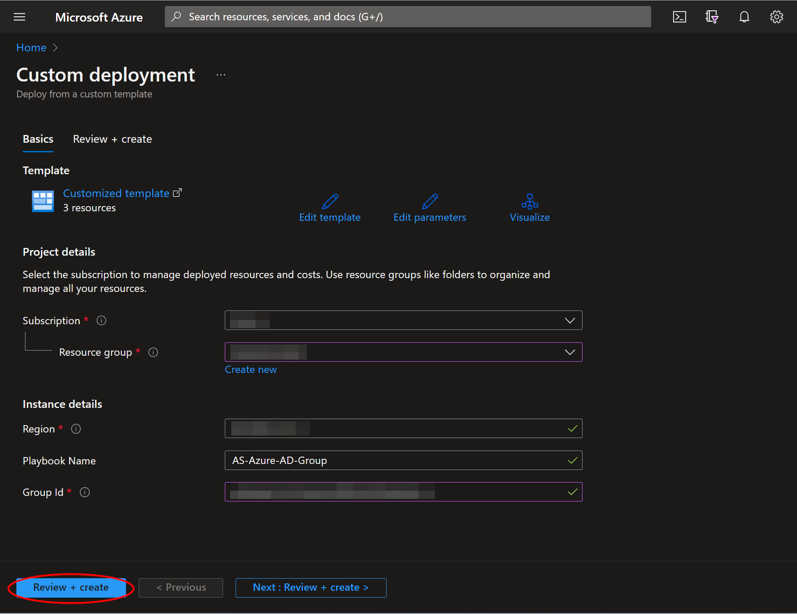
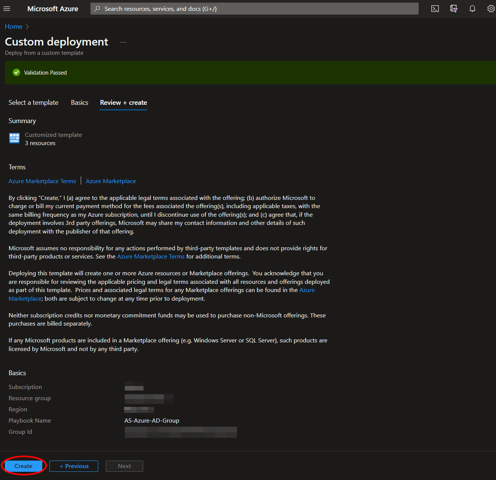
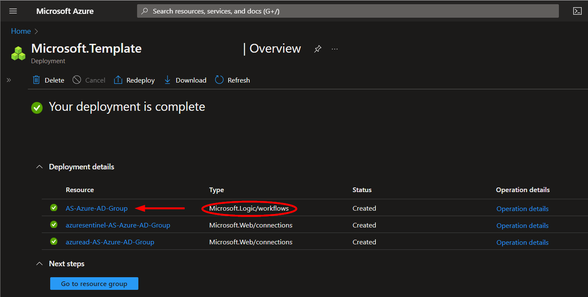
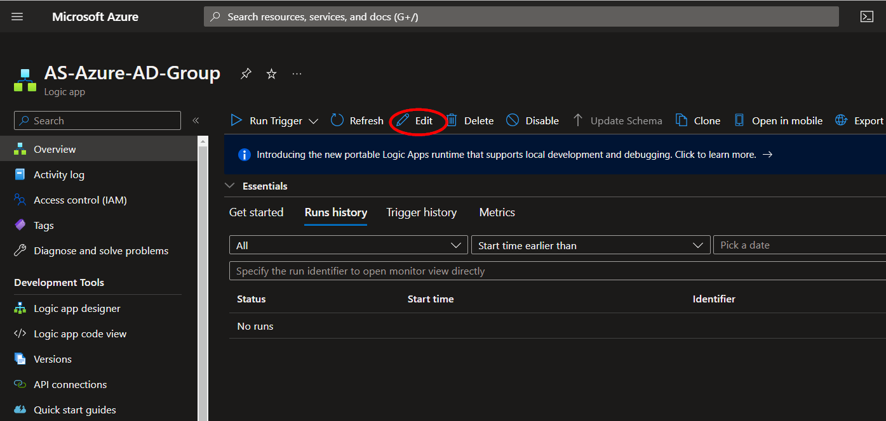
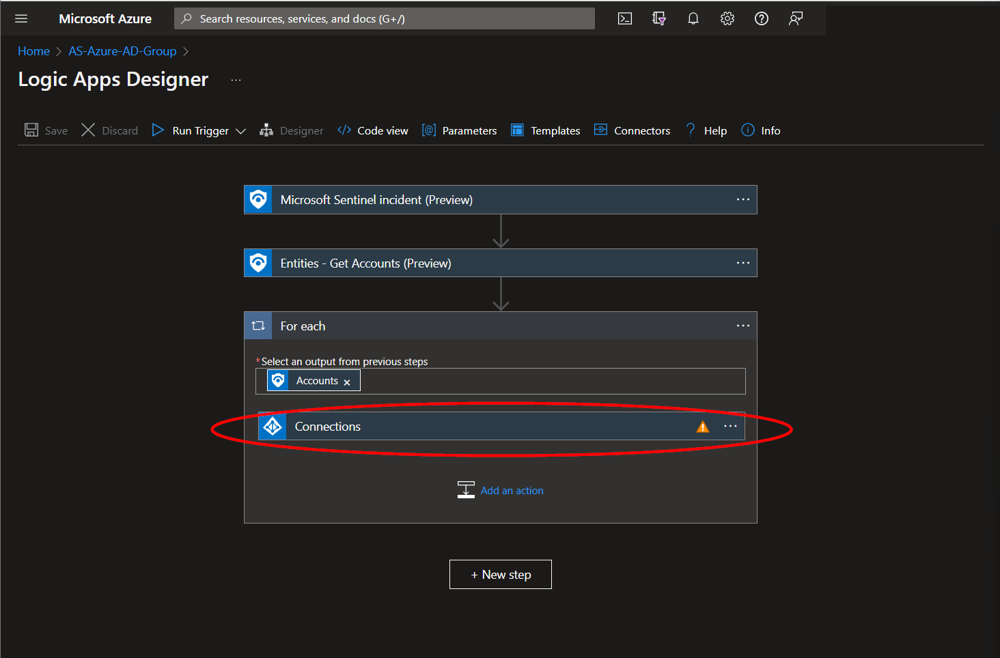
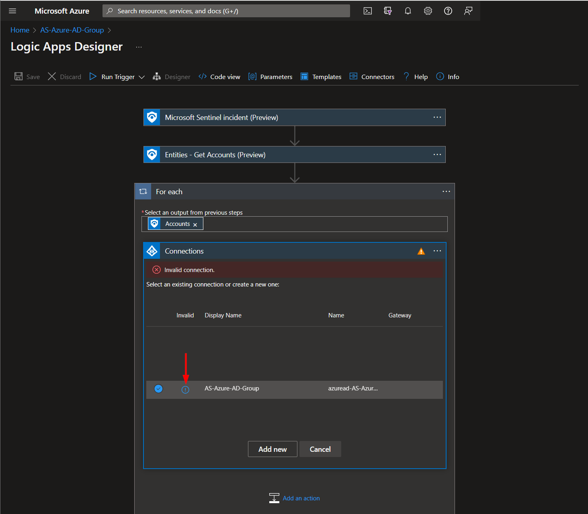
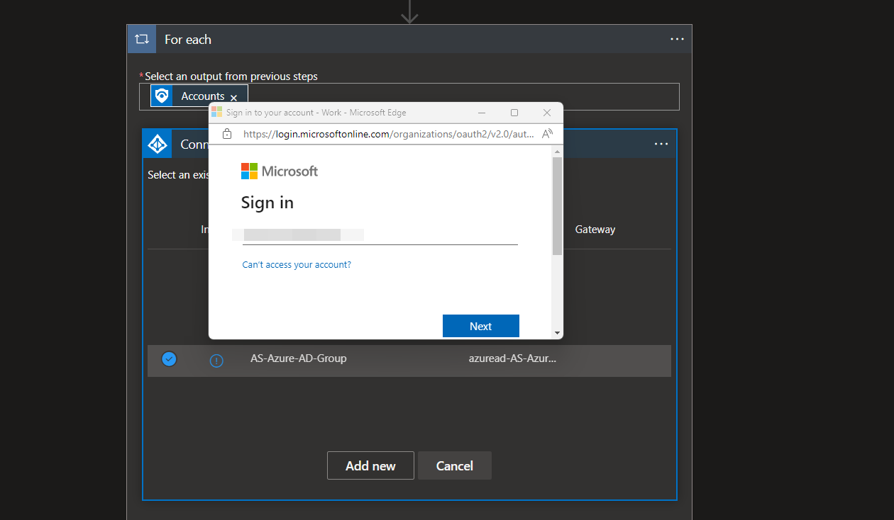

# AS-Azure-AD-Group
Author: Accelerynt

For any technical questions, please contact info@accelerynt.com  

    

This playbook is intended to be run from a Microsoft Sentinel incident. It will add accounts from Microsoft Sentinel incidents to an Azure AD Group of your choice.

#
### Requirements

The following items are required under the template settings during deployment: 

* The [id](https://github.com/Azure/Azure-Sentinel/tree/master/Playbooks/AS-Azure-AD-Group#azure-active-directory-group-id) of your Azure Active Directory group

# 
### Setup

#### Azure Active Directory Group Id:

Before deployment, you will need to note the Id of the Azure Active Directory group you would like the playbook to use.

Navigate to the Azure Active Directory Groups page: https://portal.azure.com/#view/Microsoft_AAD_IAM/GroupsManagementMenuBlade/~/AllGroups

Click the desired group and from the overview page, copy the value of the "**Object Id**" field.

#
### Deployment

To configure and deploy this playbook:

Open your browser and ensure you are logged into your Microsoft Sentinel workspace. In a separate tab, open the link to our playbook on the Arbala Security GitHub Repository:

https://github.com/Accelerynt-Security/AS-Azure-AD-Group

Click the “**Deploy to Azure**” button at the bottom and it will bring you to the custom deployment template.

In the **Project Details** section:

* Select the “**Subscription**” and “**Resource Group**” from the dropdown boxes you would like the playbook deployed to.  

In the **Instance Details** section:  
                                                  
* **Playbook Name**: This can be left as "**AS-Azure-AD-Group**" or you may change it. 

* **Group Id**: Enter the Id copied from the setup step

Towards the bottom, click on “**Review + create**”. 

Once the resources have validated, click on "**Create**".

The resources should take around a minute to deploy. Once the deployment is complete, you can expand the "**Deployment details**" section to view them.
Click the one corresponding to the Logic App.

Click on the “**Edit**” button. This will bring us into the Logic Apps Designer.

Before the playbook can be run, the Azure AD connection will either need to be authorized in the indicated step, or an existing authorized connection may be alternatively selected. This connection can be found under the third step labeled "**For each**".

Expand the "**Connections**" step and click the exclamation point icon next to the name matching the playbook.
                                                                                                

When prompted, sign in to validate the connection.                                                                                                

