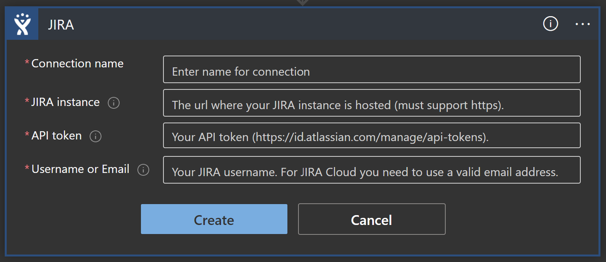
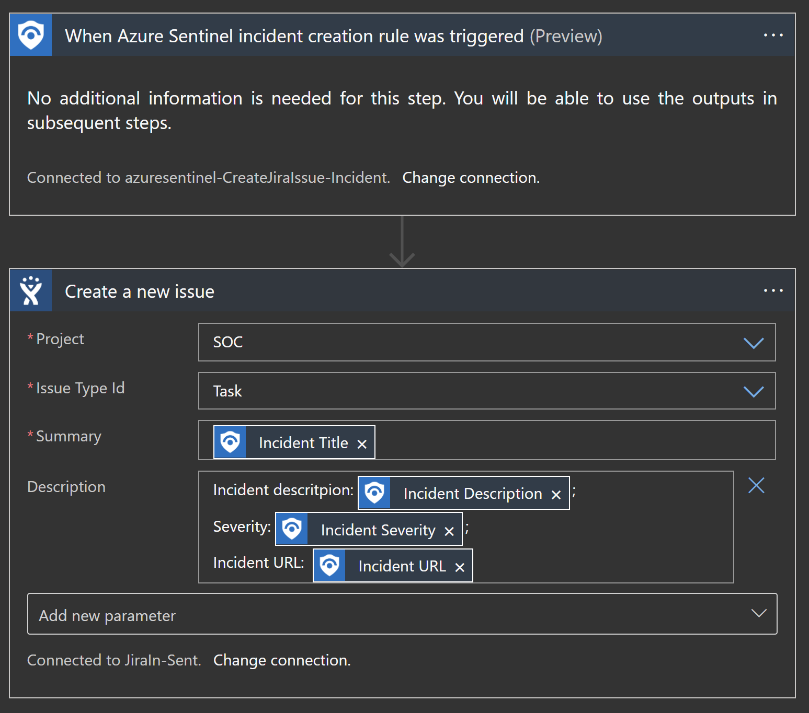
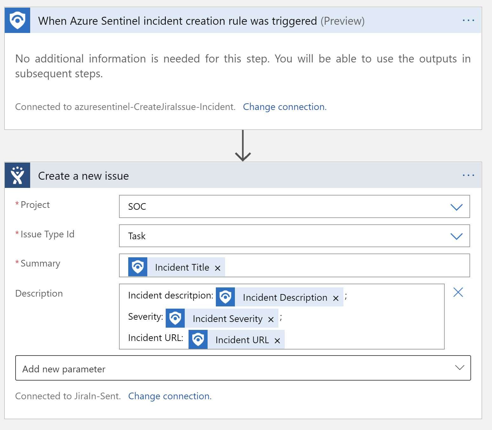
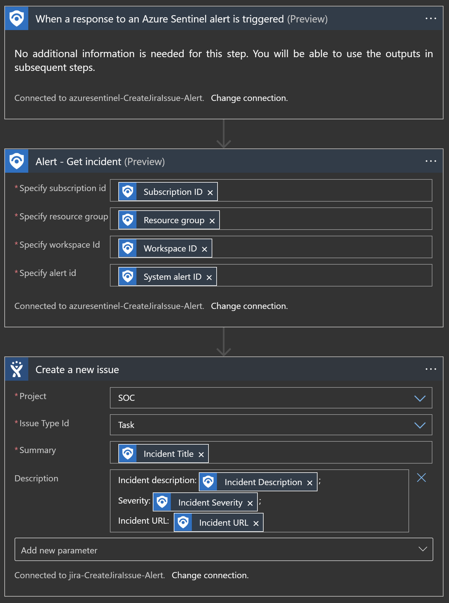
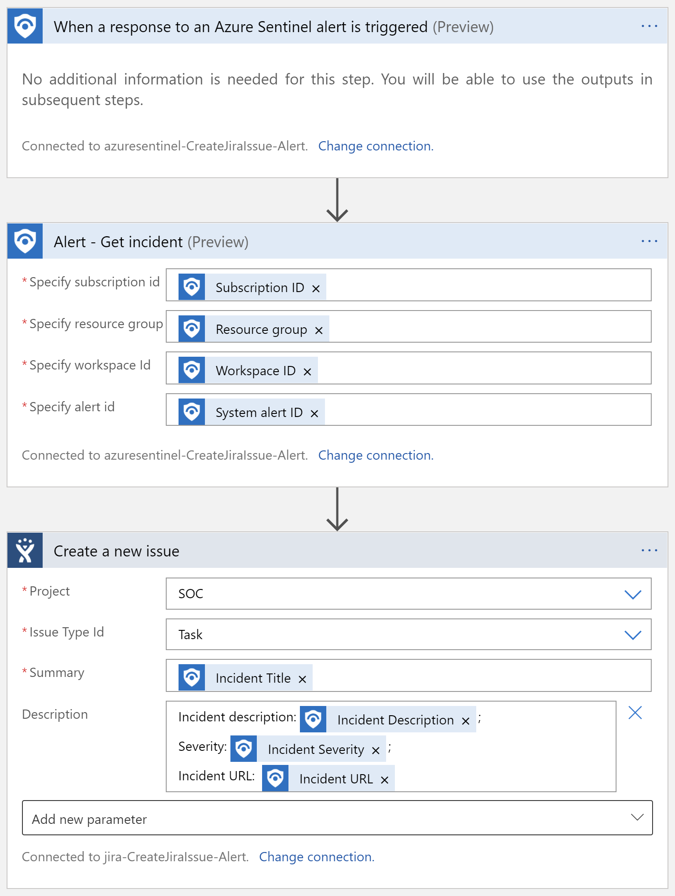

# Create-Jira-Issue
author: Yaniv Shasha, Benjamin Kovacevic

This playbook will open a Jira Issue when a new incident is opened in Microsoft Sentinel. 
 
## Prerequisites

We will need following data to make Jira connector: 
1. Jira instance (ex. xyz.atlassian.net) 
2. Jira API (create API token on https://id.atlassian.com/manage-profile/security/api-tokens) 
3. User email 
 
 
## Quick Deployment
**Deploy with incident trigger** (recommended)

After deployment, attach this playbook to an **automation rule** so it runs when the incident is created.

[Learn more about automation rules](https://docs.microsoft.com/azure/sentinel/automate-incident-handling-with-automation-rules#creating-and-managing-automation-rules)

**Deploy with alert trigger**

After deployment, you can run this playbook manually on an alert or attach it to an **analytics rule** so it will rune when an alert is created.

 
 
## Post-deployment
Go to Playbook edit mode and fix Jira connection with data from Prerequisite.  
When connection is fixed, choose your:
1. Jira Project (where you want to sync Microsoft Sentinel incidents to) and
2. Issue Type Id (Microsoft Sentinel incident issue type in Jira - Task, Story, Bug,...). 
 

<strong>Note: This step is necessary only if you are deploying the Playbook using Alert trigger method from above</strong> 
We will need to assign Microsoft Sentinel Reader role to the Playbooks Managed Identity: 
1. Open Playbook and go to Settings > Identity
2. Click on Azure Role Assignments and then on Add Role Assignment
3. For Scope choose Resource group and make sure that subscription and resource group are where Microsoft Sentinel and Playbook are deployed. For Role choose Microsoft Sentinel Reader and click on Save. 
 
## Screenshots

**Incident Trigger** 
 
 
 
**Alert Trigger** 
 
 
 
**Example in Jira** 
 