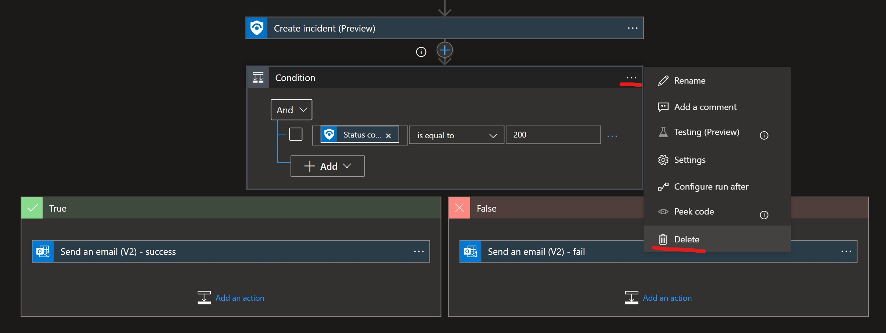
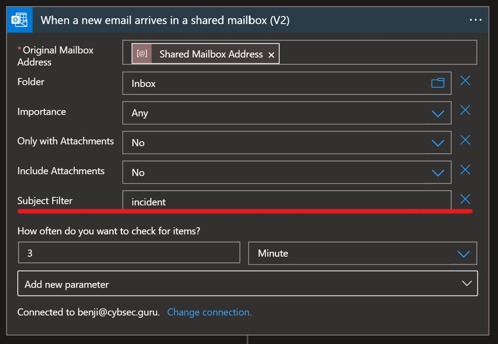
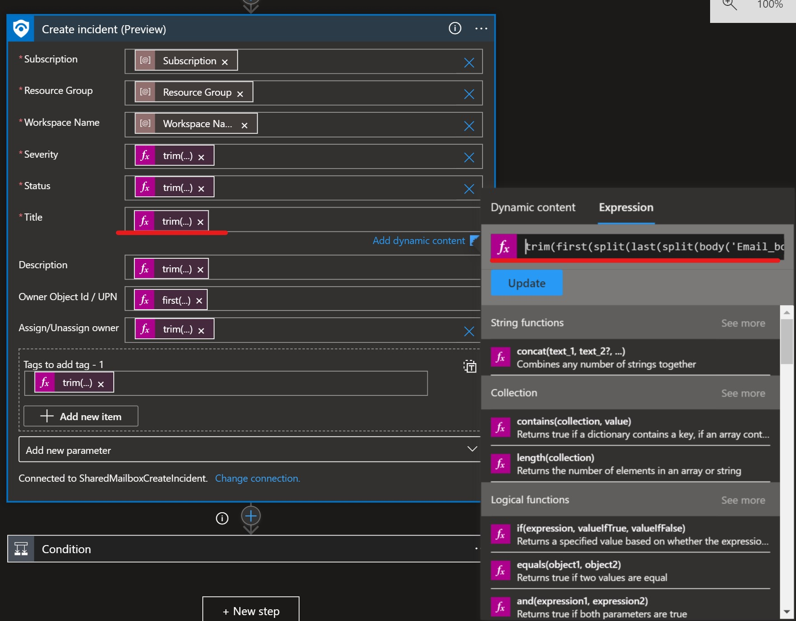
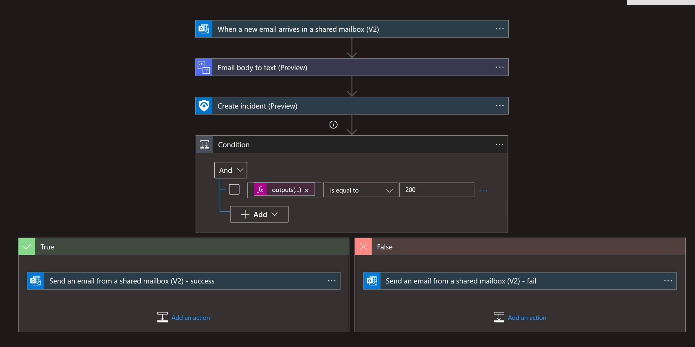
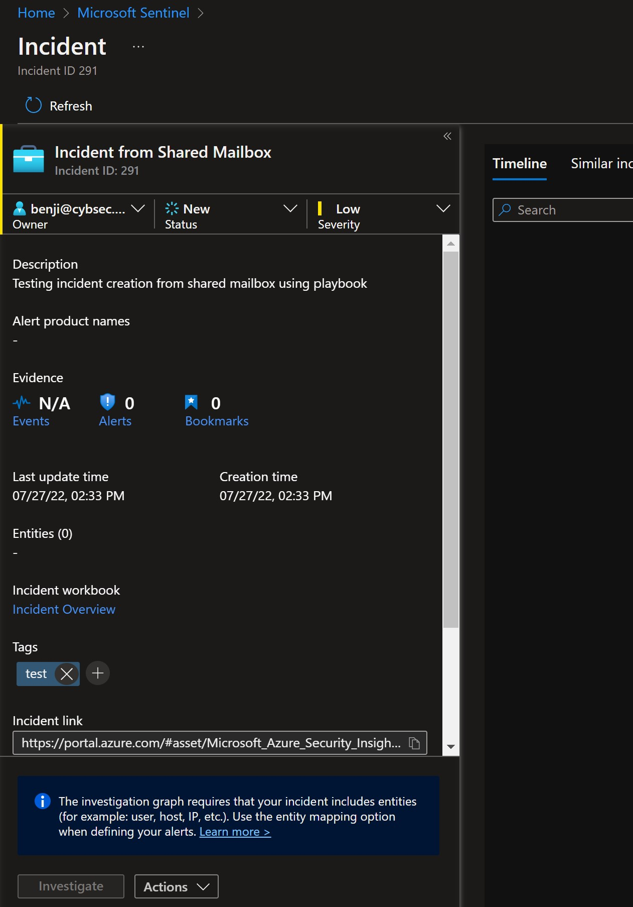

# CreateIncident-SharedMailbox
author: Benjamin Kovacevic

This playbook will create a new Microsoft Incident when a new email arrives in the shared mailbox with the "incident" keyword in the subject.

# Prerequisites
1. Create a shared mailbox that will be used for incident creation.
2. Prepare Subscription ID, Resource Group name, and Log Analytics Workspace name as it is needed for template deployment.

# Quick Deployment

  

# Post-deployment
1. Assign Microsoft Sentinel Responder role to the managed identity. To do so, choose Identity blade under Settings of the Logic App.
2. If notification about successful or unsuccessful incident creation is not needed, please delete the "Condition" step 
 
3. Authorize Office 365 Outlook connector and Conversion Service connector (HTML to text)
4. Utilize the email template to get correct data - https://github.com/Azure/Azure-Sentinel/blob/master/Playbooks/CreateIncident-SharedMailbox/NewMicrosoftSentinelIncidentCreationTemplate.oft

# Note for email template changes
1. The email subject must contain "incident" in the name. If this needs to be changed, please update the trigger: 
  
2. The email body must be in this order:
    - Incident Title: 
    - Incident Description: 
    - Incident Severity: (Informational/Low/Medium/High)
    - Incident Status: (New/Active/Closed)
    - Incident Tag: 
    - Assign Incident: (Assign/Unassign)
    - Assign Incident to: 
3. If the order or value of each or any line is changed, it is necessary to adjust that change to the playbook itself. For example - for the "Title" field in the playbook, we are trimming value from the email body that is between "Incident Title: " and "Incident Description: ". For that we are using expression "trim(first(split(last(split(body('Email_body_to_text'),'Incident Title: ')),'Incident Description: ')))"  
If you change the order in email body and move "Incident Title" after "Incident Description" update expression for field Title to "trim(first(split(last(split(body('Email_body_to_text'),'<strong>Incident Title: </strong>')),'<strong>Incident Severity: </strong>')))" and fild "Description" to "trim(first(split(last(split(body('Email_body_to_text'),'<strong>Incident Description: </strong>')),'<strong>Incident Title: </strong>')))"  
If you rename any field, an expression update is also needed. If you change line "Incident Title: " to "Title - ", update expressions to "trim(first(split(last(split(body('Email_body_to_text'),',<strong>Title - </strong>')),'Incident Description: ')))"
 
3. Note that lines "Incident Severity: ", "Incident Status: ", and "Assign Incident: " must have one of the offered values!
4. Line "Assign Incident to: " must contain Azure AD object ID or UPN value!

When editing, important information is that certain fields accept only certain values: 
1. Severity - Informational/Low/Medium/High
2. Status - New/Active/Closed
3. Owner Object Id / UPN - only Azure AD object ID or user's UPN
4. Assign/Unassign Owner - Assign/Unassign

# Screenshots

**Playbook**  
 

**Microsoft Sentinel Incident** 
 

**Email notification** 
  
 
